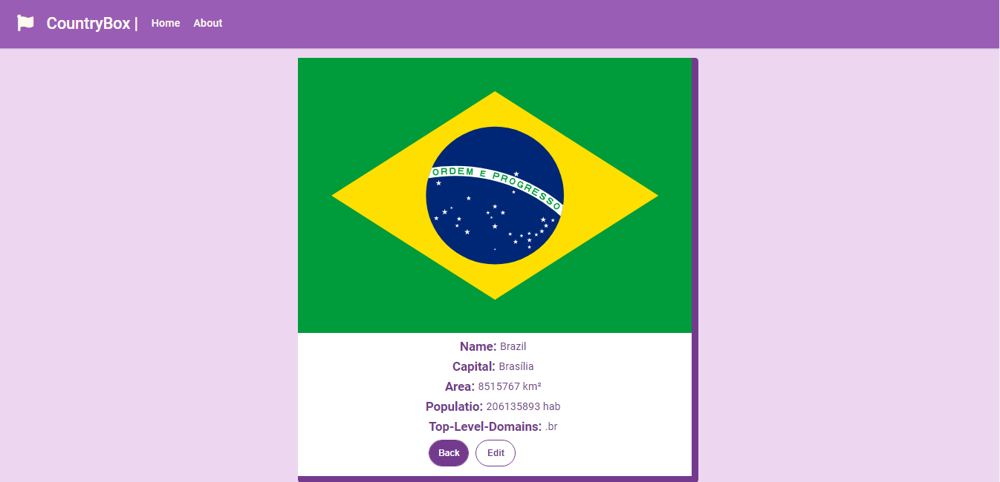
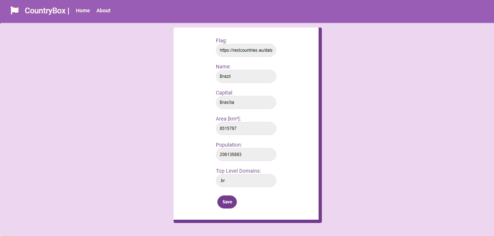

# CountryBox
It is a web application that allows you to search for a specific country by name and obtain information about it. Plus, you can edit this information if it is misleading.

## CountryBox Layout
The figures below show the final layout of the site

### CountryBox landing page


### CountryBox search results page


## CountryBox Edit results page



## Deploy
[CountryBox deploy link](https://soft-plan-task-front-end.herokuapp.com)

## API
For the BackeEnd the public API was used [Graph countries](https://github.com/lennertVanSever/graphcountries)

## Test
- [ ] Create a list of cards to display the countries showing the flag, name and capital of it;
- [ ] Enable the user to search for countries;
- [ ] In the list, the user can go to the country details page and see a more complete list of information (flag, name, capital, area, population and top-level domain);
- [ ]  Create a form to edit the data of a country (saving only on the client side);

## Project
 
## How to use this aplication

### Clone Repository

```bash
# Clone this repository
$ git clone https://github.com/abraaovilanova/soft-plan-task-front-end
# Access the project folder
$ cd soft-plan-task-front-end
# Install the dependencies
$ npm install
# Start the project
$ npm start
```

#### `npm start`

Runs the app in the development mode.\
Open [http://localhost:3000](http://localhost:3000) to view it in the browser.

The page will reload if you make edits.\
You will also see any lint errors in the console.

Made with Love :gift_heart: by Abraão Vila Nova in Recife